# AWS CLI 에서 이것저것


## IAM 정보 생성 및 얻기

IAM 대시보드로 이동합니다.  
- AWS 웹콘솔에서 'IAM'이라고 검색하면 메뉴가 나오므로 쉽게 갈 수 있습니다.  
- url이 가끔 바뀌는듯 하니 검색해서 찾는 걸 권장 (이 글을 쓰는 현재 https://console.aws.amazon.com/iamv2/home )

사용자 블레이드를 선택하여 나를 선택합니다.


액세스 키가 이미 만들어져 있는 게 있으면 (+ 비밀 키를 알 수 있다면) 그걸 쓰면 되고 아니라면 새로 만들어야겠죠.
[액세스 키 만들기] 버튼을 눌러 생성합니다. 과정은 어렵지 않으니 자세한 건 넘어가겠으나 비밀키 등을 잘 기억하셔야(적어두셔야) 합니다.

여기서 기억한 정보를 아래에 기입합니다.


## AWS CLI 설치

여기를 참조해서 진행: https://aws.amazon.com/ko/cli/

64비트 실행 프로그램을 다운받아 설치.

설치 후 인증/권한 위한 명령 실행

```
C:\Users\rindon>aws configure
AWS Access Key ID [None]: AKIAYUPXW4SKDIE9D01X                        <-- 적당히 바꾼 것이니 염려 마세요
AWS Secret Access Key [None]: gA+xBBs1XxxxYyyyyzzzAaaaa2ooo0pppppEaan <-- 적당히 바꾼 것이니 염려 마세요
Default region name [None]: ap-northeast-2                            <-- 서울
Default output format [None]: 그냥엔터                                 <-- json/yaml/text/table 선택가능
```

이 입력 결과는 홈디렉터리 밑의 ```.aws``` 밑에 파일로 저장됩니다

아마 앞으로 지겹게 쓰게 될 명령어:
```
> aws eks help
```

## AWS EKS 클러스터 준비

먼저 AWS에서 전형적으로 하게 되는 VPC / Subnet / 기타등등 을 셋업해 보겠습니다.

다음을 참조하고 있습니다:
https://docs.aws.amazon.com/ko_kr/eks/latest/userguide/getting-started-console.html
- 위 링크는 cloudformation 으로 VPC 나 subnet들을 생성하고 인터넷 연결 등을 설정하는데 기본적으로 갖출 것을 갖추고 있음.
- ```
  aws cloudformation create-stack \
  --stack-name ds04226-eks-vpc-stack \
  --template-url https://s3.us-west-2.amazonaws.com/amazon-eks/cloudformation/2020-10-29/amazon-eks-vpc-private-subnets.yaml
  {
      "StackId": "arn:aws:cloudformation:ap-northeast-2:592806604814:stack/ds04226-eks-vpc-stack/c3521c70-a1ab-11eb-9521-0a386e742970"
  }
  ```
  이렇게 한 것만으로 VPC 를 포함한 리소스들이 만들어집니다.
  * VPC 1개 (AWS::EC2::VPC)
  * Subnet 4개 (AWS::EC2::Subnet)
    - public subnet 2개
    - private subnet 2개
    - cloudformation 기술자를 보면 Subnet은 VPC에 종속됩니다  
      ```
        PublicSubnet01:
          Type: AWS::EC2::Subnet
          ...
          Properties:
            ...
            VpcId:
              Ref: VPC
      ```
  * 라우트 테이블 4개 (AWS::EC2::RouteTable)
    - 기본 1개 (cloudformation 기술자에는 안보이는 걸로 보아 VPC 생성 시 기본으로 만들어지는 것인 듯)
    - Public 1개가 2개의 public subnet에 연결
      * subnet 메뉴에서 보이는 라우팅 테이블이 바로 이것
    - Private 2개가 각기 하나씩 private subnet에 연결
    - cloudformation 기술자엔 이 연결에 해당하는 개체 AWS::EC2::SubnetRouteTableAssociation 4개가 선언되어 있음
    - outbound 통신을 위해 Gateway 들과 연결 (이 연결도 개체 -- AWS::EC2::Route )
      * public 라우트 테이블은 인터넷 게이트웨이와 연결
      * private 라우트 테이블들은 하나씩 NATGateway와 연결
    - cloudformation 기술자를 보면 라우트 테이블은 VPC에 종속됩니다  
      ```
        PublicRouteTable:
          Type: AWS::EC2::RouteTable
          Properties:
            VpcId: !Ref VPC     # VPC ID 를 속성으로 가짐
      ```
  * 라우트 (AWS::EC2::Route)
    - DestinationCidrBlock 속성을 가지며, 웹콘솔에서 라우팅테이블 정보에 해당함
    - 성격상 라우트테이블 정보의 한 Row 정도로 보는 게 맞을 듯
    - public 1개
      * RouteTableId 속성, GatewayId 속성을 가져 둘을 연결함
    - private 2개
      * RouteTableId 속성, NatGatewayId 속성을 가져 둘을 연결함
  * 인터넷 게이트웨이 1개 (AWS::EC2::InternetGateway)
    - public 라우팅테이블과 연결
    - cloudformation 상에선 VPC와 연결되어 있는데  
      그 사이를 잇는 개체로 AWS::EC2::VPCGatewayAttachment 가 존재
  * EIP 2개 (AWS::EC2::EIP)
    - 각기 하나씩 NATGateway에 할당되어 있음  
      (cloudformation 기술자 상에선 NATGateway가 EIP를 가리키는(의존하는) 것으로 되어 있음)
  * NATGateway 2개 (AWS::EC2::NatGateway)
    - 각기 하나씩 public subnet 안에 존재하면서
    - 각기 하나씩 private subnet 과 연결되어 있음 (라우트 테이블 / 라우트 로) 
  * Network ACL 1개
    - 4개의 subnet에 연결
  * 보안 그룹 1개 (AWS::EC2::SecurityGroup)
    - cloudformation 기술자를 보면 VPC에 종속되는 개체임이 보임:
      ```
        ControlPlaneSecurityGroup:
          Type: AWS::EC2::SecurityGroup
          Properties:
            GroupDescription: Cluster communication with worker nodes
            VpcId: !Ref VPC
      ```
- 참고로 Cloudformation 특징을 간단히 그려봤습니다. (모두 테스트해 보고 쓴 건 아니라 나중에 교정할 수 있음)
  


## AWS EKS 클러스터 권한 준비

다음을 실행합니다. (Windows Command 가정)
```
> copy con cluster-role-trust-policy.json
{
  "Version": "2012-10-17",
  "Statement": [
    {
      "Effect": "Allow",
      "Principal": {
        "Service": "eks.amazonaws.com"
      },
      "Action": "sts:AssumeRole"
    }
  ]
}
^Z
```
이건 그냥 빈 껍데기 같습니다. 아닐 수도 있지만  
암튼 이걸 가지고 역할을 생성하고
```
> aws iam create-role --role-name ds04226-eks-cluster-role --assume-role-policy-document file://"cluster-role-trust-policy.json"
```
(이 상태까지는 웹콘솔에서 보면 정책을 연결해야 한다고 나옵니다)  
여기에 EKS관리용 정책을 부여하라고 하네요.
```
> aws iam attach-role-policy --policy-arn arn:aws:iam::aws:policy/AmazonEKSClusterPolicy --role-name ds04226-eks-cluster-role
```

이렇게 주고 나서 웹 콘솔 IAM 화면에서 만든 역할을 확인해 보면 다음과 같이 나옵니다:

  
부여한 정책이 보입니다.

  
앞서 허용한 서비스가 신뢰할 수 있는 개체로서 표시됩니다.

  
부여한 `AmazonEKSDClusterPolicy` 정책에서 따라오는 다섯 개의 서비스가 접근 허용되어 있습니다.


## kubectl 연결

`kubectl` 이 설치되어 있다고 가정합니다.

다음 명령으로 어떤 클러스터가 현재 존재하는지 확인합니다:
```
> aws eks list-clusters --region ap-northeast-2
{
    "clusters": [
        "<cluster-name-1>",
        "<cluster-name-2>",
        ...
    ]
}
```


다음 명령으로 접속권한(접속을 위한 키 등등)을 얻습니다:
```
> aws eks update-kubeconfig --region ap-northeast-2 --name <cluster-name>
Added new context arn:aws:eks:ap-northeast-2:011122223337:cluster/<cluster-name> to C:\Users\Administrator\.kube\config
```

다음 명령으로 이를 확인하고 접근할 클러스터를 선택할 수 있습니다:
```
> kubectl config get-contexts
> kubectl config use-context 
```


## Persistence 를 위한 설정

참조링크: https://aws.amazon.com/ko/premiumsupport/knowledge-center/eks-persistent-storage/  
(주의할 것은 여기 있는 것도 그대로 실행하면 안됨. 이를테면 github url 이 요새 쓰는 형식이 아님. 해보면 압니다)

EBS와 EFS중 방식 선택해야 하는데 가용성 측면에서 강점이 있는 EFS를 선택합니다.
위 링크의 문서에선 [옵션 B: Amazon EFS CSI 드라이버 배포 및 테스트] 부분입니다.

먼저 정책 하나를 만들고
```
# curl 이 안깔려 있으면 브라우저로 받으면 됨
> curl -o iam-policy-aws-efs-csi-driver.json https://raw.githubusercontent.com/kubernetes-sigs/aws-efs-csi-driver/v1.2.0/docs/iam-policy-example.json

> aws iam create-policy --policy-name AmazonEKS_EFS_CSI_Driver_Policy --policy-document file://iam-policy-aws-efs-csi-driver.json
```

다음엔 oidc provider url을 얻고 account_id 와 함께 사용해 또다른 정책을 생성합니다.
```
> aws eks describe-cluster --name your_cluster_name --query "cluster.identity.oidc.issuer" --output text
https://oidc.eks.ap-northeast-2.amazonaws.com/id/3FAA................9792
```


