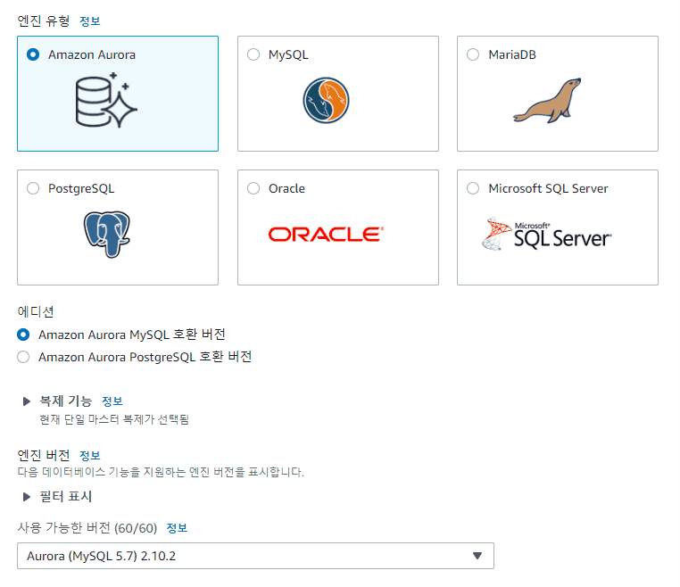

# AWS resource를 start / stop 하는 API 존재여부

## Virtual Machine

있음 (내용은 생략)

## Databases

RDS 메뉴로 가서 데이터베이스 생성을 선택하면 다음 선택지가 존재:

어떤 RDS 를 선택해도 Aurora를 serverless로 택한 것만 아니면 start/stop이 가능함.

## VMSS

VMSS는 resource 개수를 지정함으로써 간접적으로 Virtual Machine의 start/stop 을 수행. 

EC2 메뉴에서 보이는 Auto Scaling Group 을 제어 가능함.
- 최소 / 원하는(default) / 최대

