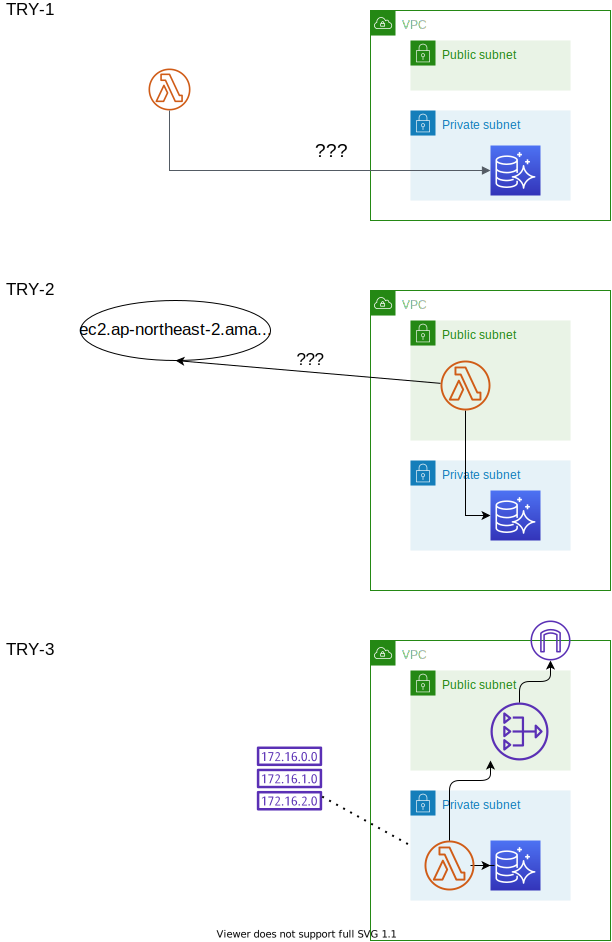

# 람다함수 등록하고 테스트

2021-03-26 테스트하면서 남긴것들 끌어모음..


## 일정 시각마다 실행하는 람다함수 만들기


### 기본 구성

lambda 화면으로 이동
함수 블레이드 클릭
함수 생성 버튼 클릭
- 이름 ds04226-ec2-start-and-stop
- 코드 작성
  ```
  import boto3
  #import pprint
  import json
  
  
  def lambda_handler(event, context):
      #ec2_client = boto3.client('ec2', region_name='ap-northeast-2')
      # (copied from ds05599 lambda function)
      #filters_Name_ds05599=[{
      #            'Name':'tag:owner',
      #            'Values':['ds05599']
      #        }]
      #        
      #instances = ec2_client.describe_instances(Filters=filters_Name_ds05599)
      #inst_ids = instances['Reservations'][0]['Instances'][0]['InstanceId']
      #ec2_client.start_instances(InstanceIds=[inst_ids])
      #ec2_client.stop_instances(InstanceIds=[inst_ids])
      
      # 이 샘플 프로그램의 목적은 정해진 시각마다 실행되면서
      # - 실행되는 시각을 얻고 확인
      # - 추가로 그 시각에 하기로 한 무언가를 확인
      print(f"{event['time']} 에 시작 혹은 종료될 뭔가를 찾아요")
      print(f"""context:\n name={context.function_name} , version={context.function_version} , 
                mem_lim={context.memory_limit_in_mb} , context_id={context.identity.cognito_identity_id} ,
                context_pool_id={context.identity.cognito_identity_pool_id} , 
                client_context={context.client_context} , 
             """
          )
      #    f"str(context.cognito_identity_id) , {context.cognito_identity_pool_id} , " + 
      #    f"{context.client_context}"
      #     )
      #return {
      #    'statusCode': 200,
      #    'body': {"event": json.dumps(event), "context": json.dumps(context) }
      #}
  
  
  ```
- 트리거 추가
  * 타입: EventBridge(Cloudwatch Events)
  * 이름: every-minutes
  * cron expression: cron(* * * * ? *)
  * 이벤트 버스:default
- 권한
  * 적당히 람다함수 실행할 때 쓰는 거 하나 골랐음.
  * 이걸 잘 고르거나 아예 새로 선택해야 함. 이미 존재하는 거 하나 선택했다가 
    로그를 eu-central-1 으로 보내려고 해서 (당연히 거기 아무것도 없으니 하나도 남지 않음) 한참 원인 모르고 함
- 대상
  * 비워둠. (이건 람다 연쇄적 실행하려고 할 때 쓰이는 것 같음)
  
### 기능 추가

- 람다함수에 레이어 추가하기
  * 다음 기능들이 필요하여 추가 레이어로 넣습니다.
    - boto3 실행을 위한 기능
    - mariadb 접근을 위한 기능
  * 일반적인 가상머신이나 컨테이너라면 그 안에 파이썬 라이브러리를 설치하면 될 것이지만, 람다는 그렇게 못하므로
    어떤 라이브러리를 사용하고 싶다면 두 가지 정도의 접근이 필요합니다.
    - 내가 만든 람다함수 코드를 라이브러리와 함께 말아서 올리는 식으로 디플로이
    - 람다함수 코드는 따로 디플로이하고, 여기서 쓸 layer를 따로 올림
    후자가 당연히 더 권고되는 패턴입니다. 다음과 같이 해보겠습니다.
  ```
  D:\>mkdir python_tmp
  D:\>cd python_tmp
  D:\python_tmp>mkdir python
  D:\python_tmp>pip3 install pymysql -t python
  D:\python_tmp>pip3 install boto3 -t python
  D:\python_tmp>"c:\Program Files\7-Zip\7z.exe" a ..\boto3-layer.zip .
  D:\python_tmp>aws lambda publish-layer-version --layer-name boto3-layer --zip-file fileb://d:\boto3-layer.zip
  ...
      "LayerVersionArn": "arn:aws:lambda:ap-northeast-2:592806604814:layer:boto3-layer:1",
  ...
  ```
  * 유지보수를 보다 잘하려면 pymysql 과 boto3 레이어를 분리하는 게 맞겠지만 귀찮으니 패스.


### EKS 셋업

[eks셋업](https://github.com/anabaral/aws-etude/blob/master/aws-cli.md) 에서 만들었던 VPC를 그대로 사용하기로 함.


### 권한 조정

#### DB 접근 관련 권한

serverless aurora db 에 붙이려니 제약이 있어서
- 이 글 제일 밑에 그림에 설명됨
- lambda 함수를 VPC에 넣는게 나을 걸로 판단.  
- 다른 대안은 db를 public open 해야 하는데 그건 좀 아닌 걸로 판단.

쉽게 가기 위해 같은 VPC에 넣으려는데 에러가 난다.  
`The provided execution role does not have permissions to call CreateNetworkInterface on EC2`
이걸 풀려면 다음 권한이 필요한데
- "ec2:DescribeNetworkInterfaces"
- "ec2:CreateNetworkInterface"
찾아보니 예전에 lambda를 위해 만든 역할(여기서는 arn:aws:iam::592806604814:role/service-role/ds04226-lambda-1)을 찾아 여기에 정책을 더하면 됨.
- AWSLambdaVPCAccessExecutionRole
이 정책에 위의 두 권한도 포함되어 있음.

#### EC2 시작/중지 권한

이상하게 중지가 오래 걸리고 3분 이상 줘도 timeout 걸림. 늦어도 1분 안에 끝나야 하는데.

다음 권한을 만들어서 (주어진 정책에서 안찾아져서) 추가함.
- 이름: EC2StartStopRole
- 내용:
  ```
  {
    "Version": "2012-10-17",
    "Statement": [
      {
        "Effect": "Allow",
        "Action": [
          "logs:CreateLogGroup",
          "logs:CreateLogStream",
          "logs:PutLogEvents"
        ],
        "Resource": "arn:aws:logs:*:*:*"
      },
      {
        "Effect": "Allow",
        "Action": [
          "ec2:Start*",
          "ec2:Stop*"
        ],
        "Resource": "*"
      }
    ]
  }
  ```
- 전체 정책들은 (아마도 만들 때 주어졌던 정책까지 합쳐) 다음 4개임 (2021-05-14)
  * AWSLambdaVPCAccessExecutionRole
  * EC2StartStopRole
  * AWSLambdaTestHarnessExecutionRole-8d8313fb-e016-4b81-bd07-954751e891b5
  * AWSLambdaBasicExecutionRole-72e67c3a-85c3-4c3c-9f8c-558f00960905

### TroubleShooting

#### sts 문제

실행할 때 다음 코드에서 멈추다가 타임아웃 됨.
```sts_identity = boto3.client('sts').get_caller_identity()```
API 문서 찾아보니 다음 권한 얘기가 있는데, 한편으론 없어도 될 것처럼 나와서 고민중.
sts:GetCallerIdentity

일단은 그냥 상수값으로 부여했는데, 아래의 다른 문제를 보니 접속 문제일 지도 모르곘음.


#### timeout 문제 

```
2021-05-14T23:05:43.374+09:00	[ERROR] ConnectTimeoutError: Connect timeout on endpoint URL: "https://ec2.ap-northeast-2.amazonaws.com/"
```
권한 문제가 아니고 접속 문제였어..?

좀 검색해 보니, lambda를 VPC 안에 둘 경우 해야 할 것이 있는 듯 함.
* https://stackoverflow.com/questions/58717176/lambda-in-vpc-cannot-connect-to-aws-services
* lambda가 속한 VPC에 연결된 엔드포인트로 가서 그것이 가지고 있는 보안그룹을 찾아 그 설정에 '이 lambda로부터의 접속을 허함' 이라 해 줘야 한다고..
* 나는 lambda가 가지는 보안그룹과 이 엔드포인트의 보안그룹이 같으므로 거기에 설정하면 충분함. (mariadb 보안그룹도 같네 그러고 보니...)
  근데 무슨 접속을 허해야 하지? '모든 TCP'를? 생각하다 일단 HTTPS만 허가했는데 안되고, 모든TCP 허용해도 안됨.
* 테스트로 다음 코드를 실행해 봤는데 에러가 남
  ```
  print(urllib.request.urlopen('https://wikipedia.com').read())
  ==>
  [ERROR] URLError: <urlopen error [Errno 97] Address family not supported by protocol> Traceback (most recent call last):
  ```
* 문제의 원인을 찾은 것 같음. 
  - 링크: https://stackoverflow.com/questions/52992085/why-cant-an-aws-lambda-function-inside-a-public-subnet-in-a-vpc-connect-to-the
  - 내용 일부:
    > The reason that your Lambda function cannot access the internet, even though the Lambda function is attached to a public subnet of your VPC, 
    > is that Lambda functions do not, and cannot, have public IP addresses. You cannot send traffic to the internet, 
    > which happens via the VPC's Internet Gateway, unless you have a public IP.
    > 즉 람다 함수는 public ip를 가지지 못하므로..
  - 결국 NAT Gateway를 연결시켜 줘야 함. 만들어 놓은 것은 있는데 라우트테이블 설정상 
    람다가 private subnet으로 옮기는게 자연스럽기에 결국 옮김.
  - 람다가 다른 security group 에 얹혀 쓰이고 있었는데 별도의 SG를 만들어 줘야 함 (아웃바운드 규칙을 완전 별개로 줘야 하므로)
  - auroradb 가 속한 security group에서도 람다의 SG로부터의 접속을 허용해 줘야 하고 람다로부터의 아웃바운드도 마찬가지
  - 결국 성공. 실행 시간도 몇 초 안 걸린다.

* 대략 문제를 정리하면 다음과 같음:
  - 람다함수가 갖춰야 할 조건:
    + 만들어 둔 DB에 붙어야 한다.
    + 지정한 VM을 중지/기동 할 수 있어야 한다.
  - 시도들을 그림으로 그림:  
    
    + 시도-1 : VPC 없이 람다를 띄우기 --> DB를 붙이려면 DB접속을 VPC 밖으로 공개해야 함. 이건 좀 아니다 싶음.
    + 시도-2 : VPC의 public subnet에 람다를 띄우기 --> 람다가 public ip를 갖지 못하는 제약때문에 인터넷 접속(=VPC 밖으로의 통신)이 불가능해짐.
    + 시도-3 : VPC의 private subnet에 람다를 띄우기 --> 성공. 대신 라우팅테이블, 보안그룹, NAT Gateway 설정 등 여러 군데를 손봐야 함.


### TO-DO

* 위에 권한 부여를 위해 기존에 있는 정책으로 추가하다가 안되어서 custom 정책을 생성했는데, 이걸 다시 정리해서 이 람다만의 custom 정책을 다시 만들어야겠음.
* 위의 경험을 바탕으로 회사에서 쓰이는 기능인 [cloudadaptor 리소스 스케줄 기능](https://github.com/opmdash/cloudadaptor/blob/selee/doc/aws-res-sched-conceptual.md) -- 주의! Private Project -- 에 써야겠음


## 이번엔 호출 기반 람다함수 구성해 보자.


### 기본 구성

만드는 것은 위의 '일정시각마다 실행하는' 람다함수와 유사하며, 다만 Cloudwatch Event를 추가할 필요는 없음.

처음 구상할 때는 URL 을 오픈해서 람다를 호출할 생각을 했으나, 람다함수를 호출하는 AWS REST API와 boto3 api 가 있음을 알게 되면서 
그냥 이 기능을 쓰는 게 낫겠다고 생각함.

처음에 HelloWorld 구성으로 람다를 생성하였으며, 다만 생성 위치는 위에 기술된 VPC의 Private Subnet 으로 하였음.
처음 생성되어 있는 코드는 다음과 같음.
```
import json

def lambda_handler(event, context):
    # TODO implement
    return {
        'statusCode': 200,
        'body': json.dumps('Hello from Lambda!')
    }

```
호출 테스트는 이 코드만으로 충분하므로 일단 이걸 그대로 두겠음.


### 기능 추가

람다함수에 boto3 실행을 위한 레이어 추가하기... 는 위의 람다에서 한 그대로를 추가함. (이 레이어에는 boto3 는 불필요한데 ~~귀찮아서~~ 혹시 몰라서)

### 호출 테스트

호출코드는다음과 같음.
```
import boto3
client = boto3.client("lambda")
response = client.invoke(FunctionName="ds04226-rs-schedule-manager", InvocationType="RequestResponse", LogType="Tail", 
      Payload=('{ "schedule_id": 11,   "user_id": "jxxx15",   "instance_id": "i-0b096a88888888624",   "sch_case": "A", "type": "week", '
               '  "date": "0,1,2,3,4",   "time": "2130",   "onoff": -1,   "period_yn": "N",   "period_from": null,   "period_to": null}' ),
               Qualifier="1" )
print( response['Payload'].read() )
```
위의 Payload는 실제 보낼 json 인데 여기서는 의미 없음.  
실행은 잘 된걸로 나옴.


